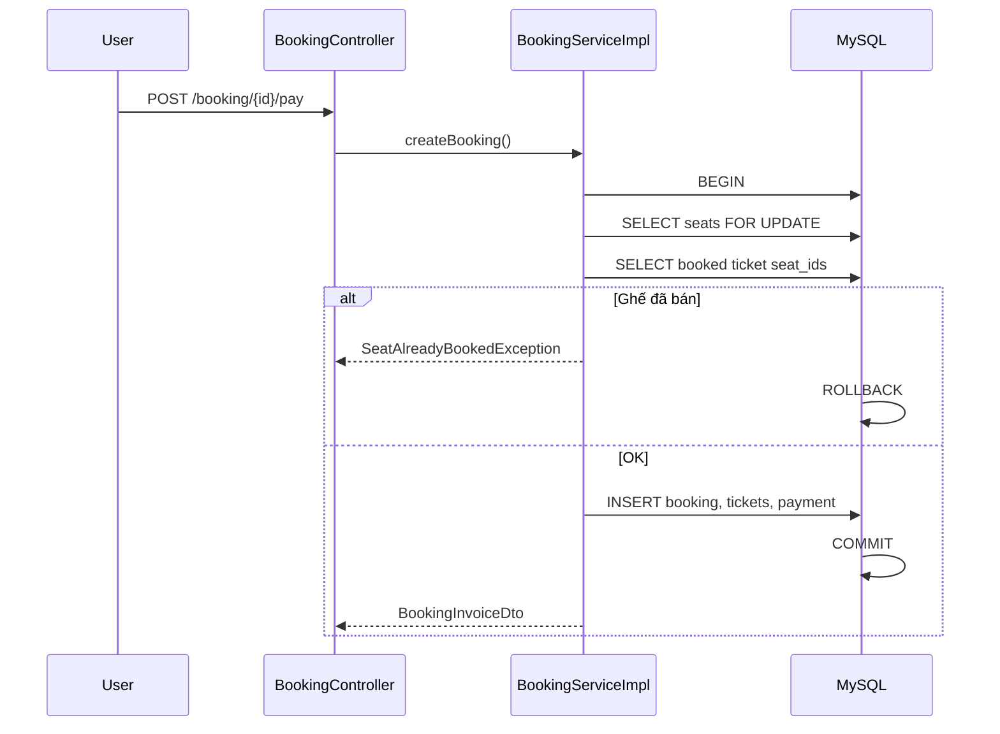

# Module Đặt Vé Rạp Chiếu — CORE-06 & CORE-07

Tài liệu kiến trúc + hướng dẫn vận hành cho module **Thanh toán vé (transaction)** và **Tra cứu lịch sử đặt vé**.

---

## 1. Phân tích nghiệp vụ

### CORE-06 — Thanh toán vé

| Hạng mục | Mô tả |
|----------|--------|
| **Input** | `userId` (session), `showtimeId`, danh sách `seatIds`, `paymentMethod` |
| **Output** | Hóa đơn (`BookingInvoiceDto`): mã booking, phim, suất, ghế, tổng tiền, trạng thái thanh toán |
| **Luồng** | Chọn ghế → Thanh toán → Lock → Kiểm tra → Lưu booking + payment + tickets → Commit |

**Edge cases:**

- Suất chiếu đã qua → từ chối.
- Ghế không thuộc phòng của suất → từ chối.
- Danh sách ghế trùng ID → từ chối.
- Một ghế đã có vé (ticket) cho suất đó → **rollback toàn bộ**, không lưu booking/payment/ticket.
- Hai user cùng đặt một ghế (race) → pessimistic lock + UNIQUE `(showtime_id, seat_id)` → một bên thất bại.

**Concurrent booking / race condition:**

```
T0: User A và B cùng chọn ghế A2
T1: A bắt đầu transaction, SELECT ... FOR UPDATE trên ghế A2
T2: B chờ lock
T3: A kiểm tra ticket → trống → INSERT ticket → COMMIT
T4: B nhận lock, kiểm tra ticket → A2 đã booked → throw SeatAlreadyBookedException → ROLLBACK
```

### CORE-07 — Lịch sử đặt vé

| Hạng mục | Mô tả |
|----------|--------|
| **Input** | `userId`, `page`, `size`, sort theo `createdAt DESC` |
| **Output** | Trang `BookingHistoryItemDto`: tên phim, poster, rạp, phòng, suất, ghế, tổng tiền, trạng thái thanh toán, mã booking, thời gian đặt |

---

## 2. Database Design

### Quan hệ (text)

```
users 1───* bookings *───1 showtimes
                │              │
                │              ├── movie
                │              └── room
                ├──1 payment
                └──* tickets *───1 seats
```

### Bảng chính (đã triển khai trong `schema.sql`)

**bookings**

| Column | Type | Ghi chú |
|--------|------|---------|
| id | INT PK AI | |
| user_id | INT FK → users | INDEX (user_id, created_at DESC) |
| showtime_id | INT FK → showtimes | |
| total_amount | DECIMAL(12,2) | |
| status | ENUM PENDING/PAID/CANCELLED | |
| created_at | TIMESTAMP | |

**tickets** (thay cho `booking_seats` — mỗi dòng = 1 vé = 1 ghế)

| Column | Type | Ghi chú |
|--------|------|---------|
| id | INT PK AI | |
| booking_id | INT FK CASCADE | |
| showtime_id | INT FK | |
| seat_id | INT FK | |
| unit_price | DECIMAL(12,2) | |
| **UNIQUE** | (showtime_id, seat_id) | Chống double booking ở tầng DB |

**payments**

| Column | Type | Ghi chú |
|--------|------|---------|
| id | INT PK AI | |
| booking_id | INT UNIQUE FK | 1-1 với booking |
| amount | DECIMAL(12,2) | |
| payment_method | VARCHAR(50) | |
| status | ENUM SUCCESS/FAILED | |
| paid_at | TIMESTAMP | |

**Trạng thái ghế:** Không cập nhật cột trên `seats` — ghế “đã bán” được suy ra từ bảng `tickets` theo `showtime_id` (tránh drift dữ liệu giữa catalog ghế và vé).

---

## 3. Entity (JPA)

- `Booking` — `@ManyToOne` User, Showtime; `@OneToMany` Ticket (cascade ALL); `@OneToOne` Payment (cascade ALL).
- `Ticket` — UNIQUE constraint JPA trên `(showtime_id, seat_id)`.
- `Payment` — `@OneToOne` Booking.
- Fetch: **LAZY** mặc định; JOIN FETCH / EntityGraph chỉ ở repository khi đọc history.

---

## 4. DTO

| DTO | Vai trò |
|-----|---------|
| `CreateBookingRequest` | API/MVC: showtimeId, seatIds, paymentMethod |
| `BookingInvoiceDto` | Hóa đơn sau thanh toán |
| `BookingHistoryItemDto` | Một dòng lịch sử |
| `SeatSelectionView` / `SeatRowView` | Màn chọn ghế |
| `ApiErrorResponse` | REST lỗi |

---

## 5. Repository

| Repository | Điểm quan trọng |
|------------|-----------------|
| `SeatRepository.findByIdInAndRoomIdForUpdate` | `@Lock(PESSIMISTIC_WRITE)` |
| `TicketRepository.findBookedSeatIdsAmong` | Kiểm tra ghế đã bán |
| `TicketRepository.findByBookingIdInWithSeat` | Batch load vé — tránh N+1 |
| `BookingRepository.findHistoryByUser` | `@EntityGraph` showtime, movie, room, payment |

---

## 6. Service

| Service | Method chính |
|---------|----------------|
| `BookingService` | `getSeatSelection`, **`createBooking`** |
| `BookingHistoryService` | `getBookingHistory` (pagination) |

`Payment` được tạo **trong cùng transaction** với `BookingServiceImpl.createBooking()` (payment không tách microservice — đúng monolith đơn giản).

### `createBooking()` — từng bước

```java
@Transactional(rollbackFor = Exception.class)
public BookingInvoiceDto createBooking(Long userId, CreateBookingRequest request) {
    // 1. Validate input & showtime chưa qua
    // 2. seatRepository.findByIdInAndRoomIdForUpdate → PESSIMISTIC_WRITE
    // 3. ticketRepository.findBookedSeatIdsAmong → nếu có → SeatAlreadyBookedException
    // 4. Tạo Booking (PAID), Tickets, Payment (SUCCESS)
    // 5. save — catch DataIntegrityViolationException (race UK)
    // 6. return BookingInvoiceDto
}
```

**Transaction boundary:** Chỉ method `createBooking` (public, qua proxy Spring). Không gọi `save` từ controller.

**Rollback:** Mọi `RuntimeException` (gồm `SeatAlreadyBookedException`) → Hibernate rollback → không còn booking/payment/ticket.

---

## 7. Transaction Flow



---

## 8. Locking Strategy

| Chiến lược | Dùng khi | Ưu | Nhược |
|------------|----------|-----|--------|
| **Pessimistic WRITE** | Đặt vé — đã chọn | Không tranh chấp khi check+insert; dễ hiểu | Lock row, có thể chờ |
| **Optimistic (@Version)** | Catalog ít tranh chấp | Không block DB | User phải thử lại; khó UX đặt vé |

**Lựa chọn dự án:** `PESSIMISTIC_WRITE` trên `Seat` + **UNIQUE** `(showtime_id, seat_id)` — defense in depth.

**Chống double booking:**

1. Lock ghế trong transaction.
2. Query ticket đã tồn tại.
3. UNIQUE constraint nếu vẫn race.

---

## 9. Controller API

### MVC (Thymeleaf)

| Method | URL | Mô tả |
|--------|-----|--------|
| GET | `/booking/{showtimeId}` | Chọn ghế |
| POST | `/booking/{showtimeId}/pay` | Thanh toán |
| GET | `/booking/history?page=0` | Lịch sử |

### REST

| Method | URL | Status |
|--------|-----|--------|
| GET | `/api/bookings/showtimes/{id}/seats` | 200 |
| POST | `/api/bookings` | 201 / 409 |
| GET | `/api/bookings/history?page=0&size=10` | 200 |

`GlobalExceptionHandler` — package `controller.api` — map `SeatAlreadyBookedException` → **409 Conflict**.

---

## 10. JSON Sample

**POST `/api/bookings`**

```json
{
  "showtimeId": 1,
  "seatIds": [1, 2, 3],
  "paymentMethod": "CASH"
}
```

**201 Created**

```json
{
  "bookingId": 10,
  "bookingCode": "BK-10",
  "movieTitle": "Avengers: Endgame",
  "moviePoster": "/images/avengers.jpg",
  "cinemaName": "CineMax Cinema",
  "roomName": "Phòng 1 - IMAX",
  "showtimeStart": "2026-05-25T19:00:00",
  "seatNames": ["A1", "A2", "A3"],
  "totalAmount": 255000,
  "paymentStatus": "SUCCESS",
  "paymentMethod": "CASH",
  "paidAt": "2026-05-20T14:30:00",
  "bookedAt": "2026-05-20T14:30:00"
}
```

**409 Conflict**

```json
{
  "errorCode": "SEAT_ALREADY_BOOKED",
  "message": "Một hoặc nhiều ghế đã được đặt: A2",
  "takenSeats": ["A2"]
}
```

---

## 11. Sequence Flow (text)

```
User → Chọn ghế trên UI
User → Bấm Thanh toán
Controller → BookingService.createBooking()
Service → BEGIN TX
Service → LOCK seats (PESSIMISTIC_WRITE)
Service → IF any seat in tickets FOR showtime → EXCEPTION → ROLLBACK
Service → INSERT booking, tickets, payment
Service → COMMIT
Controller → Hiển thị hóa đơn
```

---

## 12. Performance Optimization

- **INDEX** `(user_id, created_at DESC)` cho history.
- **UNIQUE** `(showtime_id, seat_id)` — lookup nhanh + integrity.
- History: `EntityGraph` trang booking + **một query** `findByBookingIdInWithSeat` cho tickets.
- Tránh `JOIN FETCH` + `Page` trên collection lớn (cartesian product) — tách 2 query.
- Giá vé cố định `85_000` — không cần join bảng giá.

---

## 13. Best Practices

| Chủ đề | Khuyến nghị |
|--------|-------------|
| Transaction boundary | `@Transactional` trên service public |
| Indexing | UK ticket, index booking user+time |
| Logging | `log.warn` khi rollback ghế |
| Fetch | LAZY entity; FETCH chỉ ở read query |
| Validation | Jakarta Validation trên `CreateBookingRequest` (API) |

---

## 14. Tổng kết kiến trúc

```
controller (MVC + REST)
    → BookingService / BookingHistoryService
        → BookingRepository, SeatRepository, TicketRepository, ShowtimeRepository
            → MySQL (InnoDB transaction)
```

**File chính:**

- `BookingServiceImpl.java` — CORE-06 transaction + lock
- `BookingHistoryServiceImpl.java` — CORE-07 JOIN strategy
- `schema.sql` — bookings, tickets, payments
- Templates: `booking-seats.html`, `booking-invoice.html`, `booking-history.html`

**Test:** Đăng nhập `customer` / `123456` → Đặt vé từ trang chủ → chọn ghế → Thanh toán → Xem `/booking/history`.

---

## Pseudo-code production

```
FUNCTION createBooking(userId, showtimeId, seatIds):
    BEGIN TRANSACTION
    showtime = loadShowtime(showtimeId)
    ASSERT showtime.start > NOW()
    seats = lockSeatsForUpdate(seatIds, showtime.roomId)
    ASSERT seats.size == seatIds.size
    taken = findBookedSeatIds(showtimeId, seatIds)
    IF taken.notEmpty():
        ROLLBACK
        THROW SeatAlreadyBookedException
    total = PRICE * seatIds.size
    booking = new Booking(PAID, total)
    FOR seat IN seats:
        booking.addTicket(showtime, seat, PRICE)
    booking.addPayment(SUCCESS, total)
    TRY save(booking)
    CATCH UniqueViolation:
        ROLLBACK
        THROW SeatAlreadyBookedException
    COMMIT
    RETURN toInvoice(booking)
```
