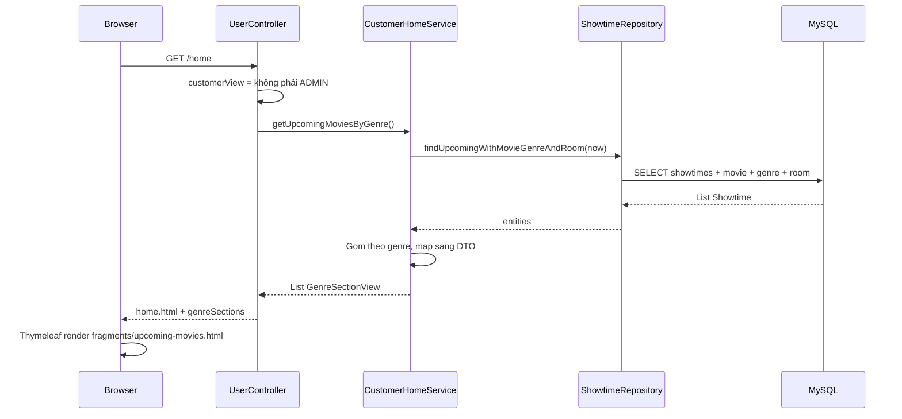

# Phim sắp chiếu (Customer) — Tài liệu chi tiết

Tài liệu này giải thích **các file và luồng code** dùng để **render danh sách phim sắp chiếu** trên trang chủ cho khách hàng (`CUSTOMER`), khách chưa đăng nhập, và `STAFF`.

---

## 1. Tổng quan luồng



**Ý nghĩa:** Không query trực tiếp `movies` — lấy từ bảng **`showtimes`** (suất chưa diễn ra), kèm phim, thể loại, phòng.

---

## 2. Điều kiện hiển thị

| Đối tượng | Thấy phim sắp chiếu? |
|-----------|----------------------|
| Chưa đăng nhập | Có |
| `CUSTOMER` | Có |
| `STAFF` | Có |
| `ADMIN` | Không — chỉ thấy link Quản lý phim / Lịch chiếu |

Logic trong `UserController.showHomePage()`:

```java
boolean customerView = user == null || user.getRole() != Role.ADMIN;
if (customerView) {
    model.addAttribute("genreSections", customerHomeService.getUpcomingMoviesByGenre());
}
```

---

## 3. Repository — Lấy dữ liệu từ DB

### File: `ShowtimeRepository.java`

**Đường dẫn:** `src/main/java/com/re/cinema_manager/repository/ShowtimeRepository.java`

| Method | Mục đích |
|--------|----------|
| `findUpcomingWithMovieGenreAndRoom(LocalDateTime from)` | **Chính** — lấy suất sắp chiếu cho trang chủ |
| `findByIdWithMovieAndRoom(Long id)` | Lấy 1 suất khi đặt vé (`/booking/{id}`) |
| `findByRoomIdWithMovieAndRoom(Long roomId)` | Dùng cho CORE-05 kiểm tra trùng phòng (admin) |
| `findAllWithMovieAndRoom()` | Danh sách admin |

**Query phim sắp chiếu:**

```java
@Query("""
    SELECT s FROM Showtime s
    JOIN FETCH s.movie m
    LEFT JOIN FETCH m.genre
    JOIN FETCH s.room
    WHERE s.startTime >= :from
    ORDER BY s.startTime ASC
    """)
List<Showtime> findUpcomingWithMovieGenreAndRoom(@Param("from") LocalDateTime from);
```

| JOIN FETCH | Lý do |
|------------|-------|
| `s.movie` | Cần title, poster, duration, genre |
| `m.genre` | Nhóm theo thể loại trên UI |
| `s.room` | Hiển thị tên phòng trên thẻ phim |

**Tham số `from`:** `LocalDateTime.now()` — chỉ suất **từ thời điểm hiện tại trở đi**.

---

## 4. DTO — Dữ liệu gửi ra View (Thymeleaf)

Entity JPA (`Showtime`, `Movie`, …) **không** đưa thẳng lên HTML — map sang DTO phẳng, dễ bind.

### 4.1 `UpcomingMovieView.java`

**Đường dẫn:** `src/main/java/com/re/cinema_manager/model/dto/UpcomingMovieView.java`

**Một thẻ phim** trên giao diện customer.

| Field | Nguồn DB | Dùng trên UI |
|-------|----------|--------------|
| `showtimeId` | `showtimes.id` | Link đặt vé `/booking/{id}` |
| `movieId` | `movies.id` | Tham chiếu (dự phòng mở rộng) |
| `title` | `movies.title` | Tên phim |
| `description` | `movies.description` | Mô tả ngắn |
| `posterUrl` | `movies.poster_url` | Ảnh poster |
| `durationMinutes` | `movies.duration_minutes` | "120 phút" |
| `genreId` | `genres.id` | Anchor `#genre-{id}` |
| `genreName` | `genres.genre_name` | Badge thể loại |
| `startTime` | `showtimes.start_time` | Giờ chiếu |
| `roomName` | `rooms.room_name` | Phòng chiếu |

### 4.2 `GenreSectionView.java`

**Đường dẫn:** `src/main/java/com/re/cinema_manager/model/dto/GenreSectionView.java`

**Một block thể loại** trên trang chủ (ví dụ: "Hành động", "Hài hước").

| Field | Ý nghĩa |
|-------|---------|
| `genreId` | ID thể loại (0 = "Khác" nếu phim không có genre) |
| `genreName` | Tên hiển thị section |
| `movies` | `List<UpcomingMovieView>` — các phim trong thể loại đó |

**Cấu trúc model gửi Thymeleaf:**

```
genreSections: List<GenreSectionView>
  └── [0] genreName = "Hành động"
        movies = [ UpcomingMovieView, UpcomingMovieView, ... ]
  └── [1] genreName = "Hài hước"
        movies = [ ... ]
```

---

## 5. Service — Logic nghiệp vụ

### Interface: `CustomerHomeService.java`

| Method | Trả về | Dùng ở |
|--------|--------|--------|
| `getUpcomingMoviesByGenre()` | `List<GenreSectionView>` | Trang chủ `/home` |
| `getShowtimeForBooking(Long showtimeId)` | `UpcomingMovieView` | Trang `/booking/{id}` |

### Implementation: `CustomerHomeServiceImpl.java`

**Đường dẫn:** `src/main/java/com/re/cinema_manager/service/impl/CustomerHomeServiceImpl.java`

#### Bước 1 — Lấy suất từ DB

```java
List<Showtime> upcoming = showtimeRepository.findUpcomingWithMovieGenreAndRoom(now);
```

#### Bước 2 — Gom theo thể loại + gộp trùng phim

- Một phim có **nhiều suất** → trên thẻ chỉ hiển thị **suất sớm nhất** (`startTime` nhỏ nhất).
- Phim không có `genre_id` → nhóm **"Khác"** (`genreId = 0`).

#### Bước 3 — Sắp xếp

- Trong mỗi thể loại: phim theo `startTime` tăng dần.
- Các section: theo `genreName` A→Z.

#### Bước 4 — Map entity → DTO

Method private `toView(Showtime, genreId, genreName)` tạo `UpcomingMovieView`.

---

## 6. Controller

### `UserController.java` — Trang chủ

| URL | Method | Model attribute |
|-----|--------|-----------------|
| `GET /`, `GET /home` | `showHomePage` | `customerView`, `genreSections` |

### `BookingController.java` — Đặt vé

| URL | Method | Model attribute |
|-----|--------|-----------------|
| `GET /booking/{showtimeId}` | `showBookingPage` | `booking` (`UpcomingMovieView`) |

**Quy tắc:**

- Chưa login → redirect `/home` + mở modal đăng nhập.
- `ADMIN` → không cho đặt vé khách.
- Suất đã qua → `errorMessage` + redirect `/home`.

---

## 7. View (Thymeleaf) — Render HTML

### 7.1 `home.html`

**Đường dẫn:** `src/main/resources/templates/home.html`

```html
<th:block th:if="${customerView}"
          th:replace="~{fragments/upcoming-movies :: upcoming-movies}">
</th:block>
```

Chỉ render khi `customerView == true`.

### 7.2 `fragments/upcoming-movies.html`

**Đường dẫn:** `src/main/resources/templates/fragments/upcoming-movies.html`

**Fragment:** `upcoming-movies`

| Phần UI | Thymeleaf |
|---------|-----------|
| Tiêu đề section | `Phim Sắp Chiếu` |
| Thanh thể loại | `th:each="section : ${genreSections}"` → link `#genre-{id}` |
| Rỗng | `th:if="${genreSections.isEmpty()}"` |
| Block từng thể loại | `th:each="section : ${genreSections}"` |
| Thẻ phim | `th:each="movie : ${section.movies}"` |
| Poster | `th:src="${movie.posterUrl}"` |
| Nút đặt vé | `th:href="@{/booking/{id}(id=${movie.showtimeId})}"` |

### 7.3 `customer/booking.html`

Trang xác nhận suất sau khi bấm **Đặt vé ngay** — dùng `booking.*` (cùng DTO `UpcomingMovieView`).

### 7.4 `fragments/navigation.html`

Link menu: `th:href="@{/home#phim-sap-chieu}"` — cuộn tới section phim sắp chiếu.

---

## 8. Seed data — Dữ liệu để test

**File:** `src/main/resources/data.sql`

| Bảng | Vai trò với phim sắp chiếu |
|------|----------------------------|
| `genres` | Tên thể loại trên section |
| `movies` | Thông tin thẻ phim |
| `rooms` | `roomName` trên thẻ |
| `showtimes` | **Bắt buộc** — không có suất tương lai thì UI rỗng |

Suất mẫu dùng ngày tương đối:

```sql
DATE_ADD(CURDATE(), INTERVAL 1 DAY) + INTERVAL 9 HOUR
```

→ Mỗi lần **restart app**, suất luôn nằm trong tương lai.

**Tài khoản test:**

| User | Password |
|------|----------|
| customer | 123456 |
| admin | admin123 |

---

## 9. Sơ đồ file (tóm tắt)

```
cinema_manager/
├── src/main/java/.../
│   ├── repository/
│   │   └── ShowtimeRepository.java      ← Query JPQL suất + JOIN FETCH
│   ├── model/dto/
│   │   ├── UpcomingMovieView.java       ← 1 thẻ phim
│   │   └── GenreSectionView.java        ← 1 block thể loại
│   ├── service/
│   │   ├── CustomerHomeService.java     ← Interface
│   │   └── impl/
│   │       └── CustomerHomeServiceImpl.java  ← Gom genre + map DTO
│   └── controller/
│       ├── UserController.java          ← GET /home → genreSections
│       └── BookingController.java       ← GET /booking/{id}
│
└── src/main/resources/
    ├── data.sql                         ← Seed phim, phòng, showtimes
    └── templates/
        ├── home.html                    ← Gọi fragment
        ├── fragments/
        │   └── upcoming-movies.html     ← Render UI chính
        └── customer/
            └── booking.html             ← Trang đặt vé
```

---

## 10. Liên quan CORE-05 (Admin — không dùng cho render customer)

Admin tạo suất tại `/admin/showtimes` qua:

- `ShowtimeController` + `ShowtimeServiceImpl` + `ShowtimeConflictChecker`
- Sau khi admin tạo suất mới → customer thấy trên `/home` ở lần refresh (data từ DB).

**Customer chỉ đọc** — không gọi logic xung đột phòng.

---

## 11. Mở rộng gợi ý

| Tính năng | Gợi ý chỉnh |
|-----------|-------------|
| Hiển thị **tất cả suất** của 1 phim | Đổi logic gộp trong `CustomerHomeServiceImpl` |
| Lọc theo thể loại (AJAX) | Thêm param `?genreId=` trên controller |
| Đặt vé chọn ghế | Mở rộng `BookingController` + entity `Seat` |
| Phân trang | Pageable trên `ShowtimeRepository` |

---

## 12. Checklist debug

1. **Không thấy phim:** Kiểm tra `showtimes.start_time >= NOW()` trong MySQL.
2. **Chỉ admin vào /home:** Đúng — admin không có `genreSections`, chỉ link quản trị.
3. **Lỗi LazyInitialization:** Đã dùng `JOIN FETCH` trong repository — không load lazy ngoài transaction view.
4. **Restart app:** `spring.sql.init.mode=always` → `data.sql` chạy lại, reset dữ liệu.

---

*Tài liệu tương ứng nhánh tính năng **Customer — Phim sắp chiếu** trong project `cinema_manager`.*
